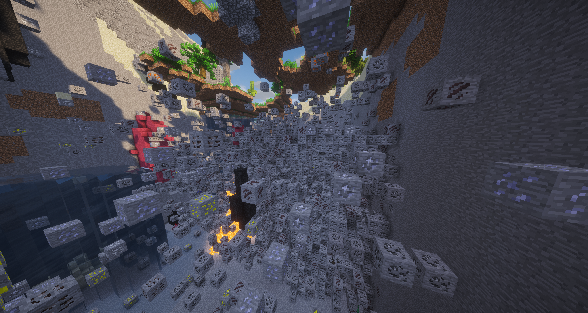

# Fortunate One

[](https://jitpack.io/#Tuxprogrammer/Fortunate-One)
[](https://github.com/Tuxprogrammer/Fortunate-One/actions/workflows/build-and-test.yml)

A Minecraft 1.7.10 Forge addon for GT5-Unofficial that removes the Fortune III cap on big ore drops and adds configurable per-dimension ore vein worldgen overrides. When **FortuneItem** drop mode is active, ore adapters will scale drops beyond fortune level 3 instead of capping at it.



## User Documentation

- [Installing](docs/installing.md) — requirements, download, and step-by-step setup
- [Configuring](docs/configuring.md) — all config options with defaults and descriptions

## How It Works

**Fortune uncapping:** GT5U hard-caps fortune-based big ore drops at level 3 inside `GTOreAdapter`, `BWOreAdapter`, and `GTPPOreAdapter`. This mod injects into those three classes via SpongeMixin and replaces the capped drop formula with an uncapped one when FortuneItem mode is active. Each adapter can be toggled independently via `gregTechUnlimitedFortune`, `bartWorksUnlimitedFortune`, and `gtPlusPlusUnlimitedFortune`. The uncapped formula is in `FortuneDropCalculator.java` and has no Minecraft dependencies, making it straightforward to unit test.

**Dimension overrides:** Per-dimension sub-sections in `config/fortunateone.cfg` let you override the Y range and layer structure of every GT ore vein for a specific dimension. A global default can be set in the top-level `dimensionOverrides` category and applies to every dimension without its own sub-section. On first startup the mod pre-populates placeholder sub-sections for all ~43 known GTNH ore-bearing dimensions (Overworld, Nether, all GalactiCraft / GalaxySpace / Amun-Ra planets, Twilight Forest, Deep Dark, etc.) so you can configure any of them immediately — no need to wait for first ore generation. Additional dimensions encountered at runtime are registered automatically. The `minY`/`maxY` height override is especially important for space dimensions: many planets use a much lower or higher Y range than the Overworld (e.g. Moon surface and most asteroid belts generate ore at Y ranges that differ significantly from typical Overworld depths). Layer counts above 9 are fully supported — the mod injects after GT's fixed 9 `generateLayer` calls and fires additional calls as needed. The in-game config GUI (accessible from the **Mods** screen) lets you edit the main options without restarting; dimension sub-sections are edited directly in the file.

## Project Structure

```
src/main/java/.../fortunateone/
  FortunateOneMod.java           @Mod entry point; registers proxy; declares guiFactory
  FortunateOneConfig.java        gtnhlib @Config holder (generates config/fortunateone.cfg)
  CommonProxy.java               Registers config, fires rebuildDimensionOverrideMap on ConfigChangedEvent
  FortuneDropCalculator.java     Pure-Java drop formula (no MC deps, fully unit tested)
  ILayerGeneratorAccess.java     Mixin accessor interface for WorldgenGTOreLayer$LayerGenerator
  VeinGenState.java              ThreadLocal carrier for per-vein override state between mixins
  client/
    FortunateOneGuiFactory.java  Forge guiFactory — entry point for the in-game config screen
    FortunateOneGuiConfig.java   gtnhlib SimpleGuiConfig screen shown from the Mods list
  mixins/
    MixinGTOreAdapter.java       Injects into gregtech.common.ores.GTOreAdapter
    MixinBWOreAdapter.java       Injects into gregtech.common.ores.BWOreAdapter
    MixinGTPPOreAdapter.java     Injects into gregtech.common.ores.GTPPOreAdapter
    MixinWorldgenGTOreLayer.java Injects into WorldgenGTOreLayer — resolves DimensionOverride, fires extra layer calls
    MixinLayerGenerator.java     Injects into WorldgenGTOreLayer$LayerGenerator — applies Y and layer overrides

src/test/java/.../fortunateone/
  FortuneFormulaTest.java        JUnit 5 tests for FortuneDropCalculator

src/functionalTest/java/.../fortunateone/
  FunctionalTest.java            Minecraft server integration tests
```

## Building

Requires JDK 8 or 17+. The Gradle wrapper is included; no local Gradle installation needed.

```bash
# Build the mod jar
./gradlew jar

# Run unit tests
./gradlew test

# Run Minecraft server integration tests
./gradlew functionalTestJar

# Build + all tests (what CI runs)
./gradlew build

# Generate a decompiled development workspace (for IDE use)
./gradlew setupDecompWorkspace
```

Output jars are written to `build/libs/`.

## Dependencies

Runtime dependency declared in `dependencies.gradle`:

```groovy
compileOnly(rfg.deobf("com.github.GTNewHorizons:GT5-Unofficial:5.09.52.551:dev"))
```

GT5U is `compileOnly` — it must be present in the player's `mods/` folder at runtime but is not bundled into the jar.

## CI / Releasing

Two GitHub Actions workflows handle CI:

| Workflow | Trigger | Purpose |
|---|---|---|
| `build-and-test.yml` | push to `main`, `workflow_dispatch` | Compile, test, run server smoke test, upload artifact |
| `release-tags.yml` | git tag push, `workflow_dispatch` | Build release jars and publish a GitHub Release |

To cut a release: tag the commit (`git tag v1.x.x && git push origin v1.x.x`), then trigger `release-tags.yml` via `workflow_dispatch` if it does not auto-fire.

## Credits

- [GT5-Unofficial](https://github.com/GTNewHorizons/GT5-Unofficial) team for the ore drop system this mod hooks into.
